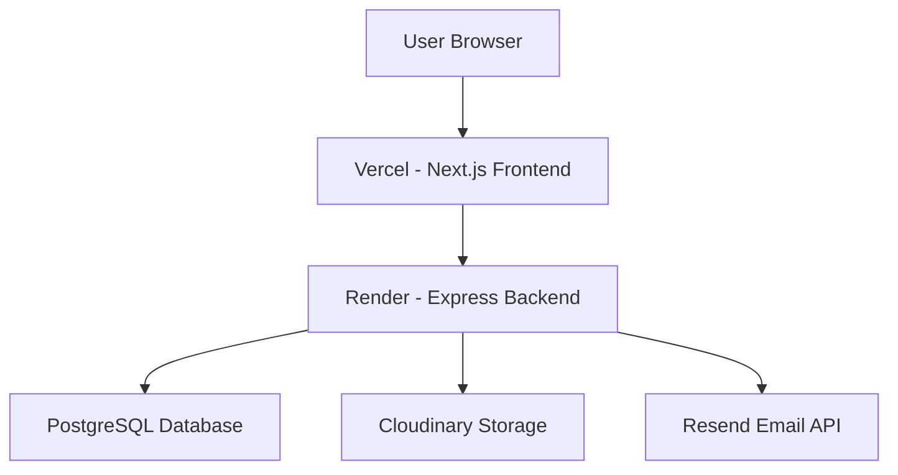

# 86 Connect

A full-stack web application for study abroad and product sourcing services connecting international clients with Chinese universities and suppliers.

## Tech Stack

- **Frontend**: [[Next.js]] 16 + React 19 + TypeScript 6 + Tailwind CSS 4
- **Backend**: Express.js 4 + Prisma ORM + TypeScript
- **Database**: PostgreSQL (production) / SQLite (development)
- **Storage**: Cloudinary (images/files)
- **Email**: Resend API
- **Deployment**: Vercel (frontend) + Render (backend)

## Architecture

## Key Files

- [[frontend/src/app/layout.tsx]] — Root layout with metadata
- [[frontend/next.config.ts]] — Next.js config with API rewrites
- [[backend/src/index.ts]] — Backend entry point
- [[backend/prisma/schema.prisma]] — Database schema
- [[backend/Dockerfile]] — Production Docker build
- [[render.yaml]] — Render Blueprint deployment
- [[frontend/vercel.json]] — Vercel deployment config
- [[.github/workflows/ci.yml]] — CI/CD pipeline

## Pages

| Route | Title | Description |
|-------|-------|-------------|
| `/` | Home | Landing page |
| `/study-in-china` | Study in China | Study abroad services |
| `/product-sourcing` | Product Sourcing | Sourcing services |
| `/book-consultation` | Book a Free Consultation | Schedule consultation |
| `/resources` | Resources & Guides | Blog and guides |
| `/faq` | Frequently Asked Questions | FAQ |
| `/privacy-policy` | Privacy Policy | Privacy policy |
| `/terms-of-service` | Terms of Service | Terms of service |
| `/login` | Login | User login |
| `/signup` | Create Account | User registration |
| `/account` | My Account | User dashboard |
| `/admin` | Admin Dashboard | Admin panel |
| `/forgot-password` | Forgot Password | Password reset |
| `/reset-password` | Reset Password | Password reset |
| `/set-password` | Set Password | Password creation |
| `/study-in-china/track-application` | Track Application | Application tracking |
| `/product-sourcing/track-quote` | Track Quote | Quote tracking |
| `/resources/[slug]` | Blog Post | Individual blog post |

## Forms

- **Contact Form** — General inquiries
- **Study Application** — Study abroad applications (up to 15 files)
- **Sourcing Inquiry** — Product sourcing inquiries (up to 15 files)
- **Consultation Booking** — Schedule consultations

## Environment Variables

See [[backend/.env.example]] for all required environment variables.

## Deployment

- **Frontend**: Push to `main` → Vercel auto-deploys
- **Backend**: Push to `main` → Render auto-deploys via `render.yaml`
- **CI/CD**: GitHub Actions runs build + lint on every push/PR